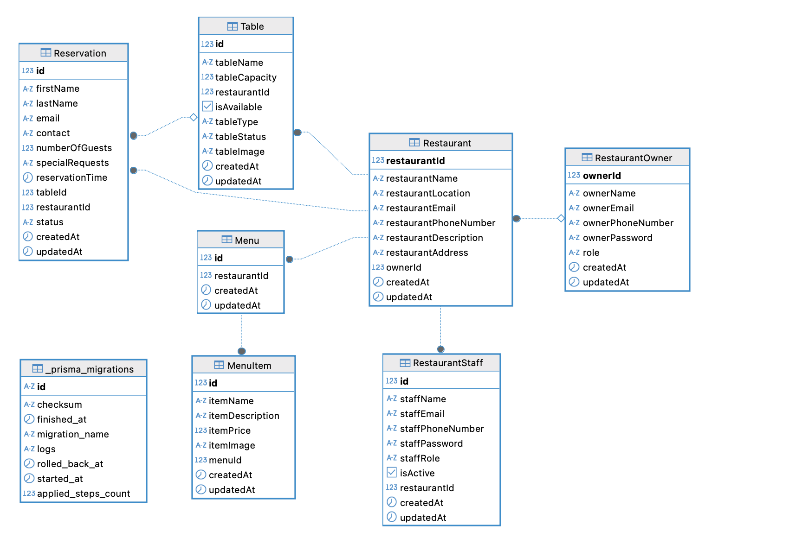

# Restofy Backend

## Overview
Restofy is a robust, production-ready restaurant management backend built with Node.js, Express, Prisma ORM, and PostgreSQL. It provides secure, scalable APIs for restaurant owners to manage restaurants, tables, menus, reservations, and staff, with authentication, RBAC, validation, and logging.

---

## Features
- **Authentication & RBAC**: JWT-based login, role-based access for owners and staff
- **Restaurant Management**: CRUD for restaurants, tables, menus, menu items, and reservations
- **Validation**: Joi-based request validation for all endpoints
- **Centralized Error Handling**: Consistent error responses and logging
- **Rate Limiting**: Protects APIs from abuse
- **Logging**: Winston-based logging to files and console
- **Testing**: Jest and Supertest for unit and integration tests
- **Prisma ORM**: Type-safe DB access and migrations
- **Extensible**: Modular Router-Controller-Service architecture

---

## Backend Folder Structure

```
back-end/
  ├── assests/                  # Static assets (e.g., ER diagrams)
  ├── prisma/                   # Prisma schema & migrations
  ├── logs/                     # Winston log files
  ├── tests/                    # Jest/Supertest tests
  ├── src/
  │   ├── admin/                # Admin routes, controllers, services
  │   ├── authentication/       # Auth logic (signup, login, JWT)
  │   ├── bill/                 # Bill management
  │   ├── constants/            # App-wide constants (e.g., permissions)
  │   ├── error/                # Error handling middleware
  │   ├── menu/                 # Menu management
  │   ├── menuItem/             # Menu item management
  │   ├── middleware/           # Auth, validation, token, etc.
  │   ├── order/                # Order management
  │   ├── payment/              # Payment management
  │   ├── rateLimiter/          # API rate limiting
  │   ├── reservation/          # Reservation management
  │   ├── restaurant/           # Restaurant CRUD
  │   ├── tables/               # Table management
  │   ├── user/                 # User management
  │   ├── utils/                # Logger, response helpers, redis, etc.
  │   ├── validation/           # Joi schemas (with subfolders for param/body/query)
  │   ├── app.js                # Express app entry point
  │   └── server.js             # Server startup
  ├── BLOCKERS.md               # Architectural decisions
  ├── LEARNING_GUIDE.md         # Learning resources and notes
  ├── env.example               # Environment variable template
  ├── future.md                 # Future plans/features
  ├── jest.config.js            # Jest config
  ├── package.json              # NPM dependencies and scripts
  ├── package-lock.json         # NPM lockfile
  └── README.md                 # Project documentation
```

---

## Technologies Used
- Node.js, Express.js
- PostgreSQL, Prisma ORM
- Joi (validation)
- JWT (authentication)
- Winston (logging)
- express-rate-limit
- Jest, Supertest (testing)

---

## Setup & Installation
1. **Clone the repo:**
   ```bash
   git clone <repo-url>
   cd Restofy/back-end
   ```
2. **Install dependencies:**
   ```bash
   npm install
   ```
3. **Configure environment:**
   - Copy `env.example` to `.env` and fill in your values.
4. **Run migrations:**
   ```bash
   npx prisma migrate deploy
   # or for dev
   npx prisma migrate dev
   ```
5. **Start the server:**
   ```bash
   npm run start:dev
   # or
   npm start
   ```

---

## Environment Variables
See `env.example` for all variables. Key ones:
- `DATABASE_URL` - PostgreSQL connection string
- `JWT_SECRET`, `JWT_EXPIRES_IN` - JWT config
- `PORT`, `NODE_ENV` - Server config
- AWS and SQS/SES variables for integrations

---

## Database Schema (Prisma)
- **RestaurantOwner**: ownerId, ownerName, ownerEmail, ...
- **Restaurant**: restaurantId, restaurantName, ownerId, ...
- **Table**: id, tableName, tableCapacity, restaurantId, ...
- **Reservation**: id, firstName, lastName, reservationTime, tableId, restaurantId, ...
- **Menu**: id, restaurantId, ...
- **MenuItem**: id, itemName, itemPrice, menuId, ...
- **RestaurantStaff**: id, staffName, staffEmail, staffRole, restaurantId, ...

See [`prisma/schema.prisma`](./prisma/schema.prisma) for full details.

---

## Database ER Diagram



---

## API Documentation
All endpoints are prefixed with `/api`.

### Auth
- `POST   /api/auth/signup` — Register a new user (owner)
- `POST   /api/auth/login` — Login, returns JWT cookie
- `GET    /api/auth/verifyToken` — Verify JWT

### Restaurants
- `GET    /api/restaurants` — List all restaurants for the authenticated user
- `POST   /api/restaurants` — Create a new restaurant
- `GET    /api/restaurants/:restaurantId` — Get a specific restaurant
- `PUT    /api/restaurants/:restaurantId` — Update a restaurant
- `DELETE /api/restaurants/:restaurantId` — Delete a restaurant

### Tables
- `GET    /api/restaurants/:restaurantId/table` — List all tables for a restaurant (supports query)
- `POST   /api/restaurants/:restaurantId/table` — Create a table
- `GET    /api/restaurants/:restaurantId/table/:tableId` — Get a specific table
- `PUT    /api/restaurants/:restaurantId/table/:tableId` — Update a table
- `DELETE /api/restaurants/:restaurantId/table/:tableId` — Delete a table
- `GET    /api/restaurants/:restaurantId/table/search?keyword=...` — Search tables by keyword

### Menus
- `POST   /api/restaurants/:restaurantId/menu` — Create a menu
- `GET    /api/restaurants/:restaurantId/menu/:menuId` — Get a menu
- `DELETE /api/restaurants/:restaurantId/menu/:menuId` — Delete a menu

### Menu Items
- `GET    /api/restaurants/:restaurantId/menu/:menuId/menuItem` — List menu items (supports query)
- `POST   /api/restaurants/:restaurantId/menu/:menuId/menuItem` — Create a menu item
- `GET    /api/restaurants/:restaurantId/menu/:menuId/menuItem/:menuItemId` — Get a menu item
- `PUT    /api/restaurants/:restaurantId/menu/:menuId/menuItem/:menuItemId` — Update a menu item
- `PATCH  /api/restaurants/:restaurantId/menu/:menuId/menuItem/:menuItemId` — Update a single field of a menu item
- `DELETE /api/restaurants/:restaurantId/menu/:menuId/menuItem/:menuItemId` — Delete a menu item

### Reservations
- `GET    /api/restaurants/:restaurantId/reservations` — List reservations (supports query)
- `POST   /api/restaurants/:restaurantId/reservations` — Create a reservation
- `GET    /api/restaurants/:restaurantId/reservations/:reservationId` — Get a reservation
- `PUT    /api/restaurants/:restaurantId/reservations/:reservationId` — Update a reservation
- `DELETE /api/restaurants/:restaurantId/reservations/:reservationId` — Delete a reservation
- `GET    /api/restaurants/:restaurantId/reservations/search?keyword=...` — Search reservations by keyword
- `PUT    /api/restaurants/:restaurantId/reservations/:reservationId/assign-table?tableId=...` — Assign reservation to a table
- `PUT    /api/restaurants/:restaurantId/reservations/:reservationId/completed?tableId=...` — Mark reservation as completed
- `PUT    /api/restaurants/:restaurantId/reservations/:reservationId/cancel` — Cancel reservation

### Orders
- `POST   /api/restaurants/:restaurantId/reservations/:reservationId/order` — Create an order for a reservation
- `GET    /api/restaurants/:restaurantId/reservations/:reservationId/order/:orderId` — Get an order
- `PUT    /api/restaurants/:restaurantId/reservations/:reservationId/order/:orderId` — Update an order
- `PUT    /api/restaurants/:restaurantId/reservations/:reservationId/order/:orderId/complete` — Complete an order

### Bills
- `POST   /api/restaurants/:restaurantId/reservations/:reservationId/order/:orderId/bill` — Create a bill for an order
- `GET    /api/restaurants/:restaurantId/reservations/:reservationId/order/:orderId/bill/:billId` — Get a bill

### Payments
- `POST   /api/restaurants/:restaurantId/reservations/:reservationId/order/:orderId/bill/:billId/payment` — Make a payment for a bill

### Users
- `POST   /api/users` — Create a user
- `GET    /api/users` — List all users
- `GET    /api/users/:userId` — Get a user
- `PUT    /api/users/:userId` — Update a user
- `DELETE /api/users/:userId` — Delete a user

---

## Request Validation
All create/update endpoints validate input using Joi schemas. See `src/validation/` for details.

---

## Error Handling & Logging
- All errors are handled by centralized middleware (`src/error/`).
- Consistent error response structure.
- Winston logs to `logs/` (error and combined logs).
- Rate limit events are logged.


---

## Architectural Decisions
See [`BLOCKERS.md`](./BLOCKERS.md) for detailed reasoning on:
- Project structure (Router-Controller-Service)
- Validation strategy
- Error handling
- RBAC
- JWT payload design
- Unified user table

---

## Best Practices
- Modular, SRP-compliant code
- All endpoints protected by authentication and RBAC
- Input validation everywhere
- Centralized error handling
- Logging and monitoring
- Rate limiting
- Extensible and testable architecture

---


## Contact
Author: Mohit Kumar 