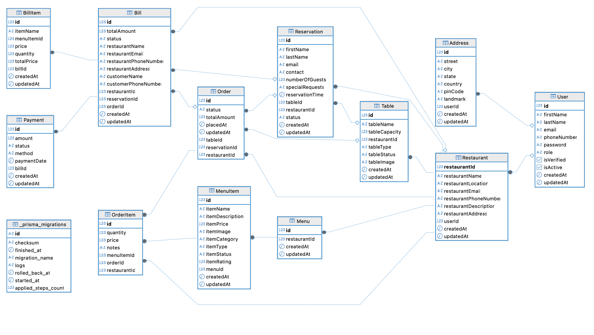

# Restofy Backend

## Overview
Restofy is a robust, production-ready restaurant management backend built with Node.js, Express, Prisma ORM, and PostgreSQL. It provides secure, scalable APIs for restaurant owners to manage restaurants, tables, menus, reservations, and staff, with authentication, RBAC, validation, and logging.

---

## Features
- **Authentication & RBAC**: JWT-based login, role-based access for owners and staff
- **Restaurant Management**: CRUD for restaurants, tables, menus, menu items, and reservations
- **Validation**: Joi-based request validation for all endpoints
- **Centralized Error Handling**: Consistent error responses and logging
- **Rate Limiting**: Protects APIs from abuse
- **Logging**: Winston-based logging to files and console
- **Testing**: Jest and Supertest for unit and integration tests
- **Prisma ORM**: Type-safe DB access and migrations
- **Extensible**: Modular Router-Controller-Service architecture

---

## Folder Structure
```
back-end/
  ├── src/
  │   ├── authentication/   # Auth logic (signup, login, JWT)
  │   ├── restaurant/       # Restaurant CRUD
  │   ├── tables/           # Table management
  │   ├── menu/             # Menu management
  │   ├── menuItem/         # Menu item management
  │   ├── reservation/      # Reservation management
  │   ├── middleware/       # Auth, validation, token, etc.
  │   ├── utils/            # Logger, response helpers
  │   ├── error/            # Error handling middleware
  │   ├── rateLimiter/      # API rate limiting
  │   ├── validation/       # Joi schemas
  │   └── app.js, server.js # App entry points
  ├── prisma/               # Prisma schema & migrations
  ├── tests/                # Jest/Supertest tests
  ├── logs/                 # Winston log files
  ├── env.example           # Environment variable template
  ├── BLOCKERS.md           # Architectural decisions
  └── README.md             # This file
```

---

## Technologies Used
- Node.js, Express.js
- PostgreSQL, Prisma ORM
- Joi (validation)
- JWT (authentication)
- Winston (logging)
- express-rate-limit
- Jest, Supertest (testing)

---

## Setup & Installation
1. **Clone the repo:**
   ```bash
   git clone <repo-url>
   cd Restofy/back-end
   ```
2. **Install dependencies:**
   ```bash
   npm install
   ```
3. **Configure environment:**
   - Copy `env.example` to `.env` and fill in your values.
4. **Run migrations:**
   ```bash
   npx prisma migrate deploy
   # or for dev
   npx prisma migrate dev
   ```
5. **Start the server:**
   ```bash
   npm run start:dev
   # or
   npm start
   ```

---

## Environment Variables
See `env.example` for all variables. Key ones:
- `DATABASE_URL` - PostgreSQL connection string
- `JWT_SECRET`, `JWT_EXPIRES_IN` - JWT config
- `PORT`, `NODE_ENV` - Server config
- AWS and SQS/SES variables for integrations

---

## Database Schema (Prisma)
- **RestaurantOwner**: ownerId, ownerName, ownerEmail, ...
- **Restaurant**: restaurantId, restaurantName, ownerId, ...
- **Table**: id, tableName, tableCapacity, restaurantId, ...
- **Reservation**: id, firstName, lastName, reservationTime, tableId, restaurantId, ...
- **Menu**: id, restaurantId, ...
- **MenuItem**: id, itemName, itemPrice, menuId, ...
- **RestaurantStaff**: id, staffName, staffEmail, staffRole, restaurantId, ...

See [`prisma/schema.prisma`](./prisma/schema.prisma) for full details.

---

## Database ER Diagram



---

## API Documentation
All endpoints are prefixed with `/api` and require authentication (except `/auth`).

### Auth
- `POST   /api/auth/signup` — Register owner
- `POST   /api/auth/login` — Login, returns JWT cookie
- `GET    /api/auth/verifyToken` — Verify JWT

### Restaurants
- `GET    /api/restaurants` — List all restaurants for owner
- `POST   /api/restaurants` — Create restaurant
- `GET    /api/restaurants/:restaurantId` — Get restaurant
- `PUT    /api/restaurants/:restaurantId` — Update restaurant
- `DELETE /api/restaurants/:restaurantId` — Delete restaurant

### Tables
- `GET    /api/restaurants/:restaurantId/table` — List tables (with query support)
- `POST   /api/restaurants/:restaurantId/table` — Create table
- `GET    /api/restaurants/:restaurantId/table/:tableId` — Get table
- `PUT    /api/restaurants/:restaurantId/table/:tableId` — Update table
- `DELETE /api/restaurants/:restaurantId/table/:tableId` — Delete table
- `GET    /api/restaurants/:restaurantId/table/search?keyword=...` — Search tables by keyword

### Menus
- `POST   /api/restaurants/:restaurantId/menu` — Create menu
- `GET    /api/restaurants/:restaurantId/menu/:menuId` — Get menu
- `DELETE /api/restaurants/:restaurantId/menu/:menuId` — Delete menu

### Menu Items
- `GET    /api/restaurants/:restaurantId/menu/:menuId/menuItem` — List menu items
- `POST   /api/restaurants/:restaurantId/menu/:menuId/menuItem` — Create menu item
- `GET    /api/restaurants/:restaurantId/menu/:menuId/menuItem/:menuItemId` — Get menu item
- `PUT    /api/restaurants/:restaurantId/menu/:menuId/menuItem/:menuItemId` — Update menu item
- `DELETE /api/restaurants/:restaurantId/menu/:menuId/menuItem/:menuItemId` — Delete menu item

### Reservations
- `GET    /api/restaurants/:restaurantId/reservations` — List reservations (with query support)
- `POST   /api/restaurants/:restaurantId/reservations` — Create reservation
- `GET    /api/restaurants/:restaurantId/reservations/:reservationId` — Get reservation
- `PUT    /api/restaurants/:restaurantId/reservations/:reservationId` — Update reservation
- `DELETE /api/restaurants/:restaurantId/reservations/:reservationId` — Delete reservation
- `GET    /api/restaurants/:restaurantId/reservations/search?keyword=...` — Search reservations by keyword
- `PUT    /api/restaurants/:restaurantId/reservations/:reservationId/assign-table?tableId=...` — Assign reservation to a table
- `PUT    /api/restaurants/:restaurantId/reservations/:reservationId/complete?tableId=...` — Mark reservation as completed
- `PUT    /api/restaurants/:restaurantId/reservations/:reservationId/cancel` — Cancel reservation

---

## Request Validation
All create/update endpoints validate input using Joi schemas. See `src/validation/` for details.

---

## Error Handling & Logging
- All errors are handled by centralized middleware (`src/error/`).
- Consistent error response structure.
- Winston logs to `logs/` (error and combined logs).
- Rate limit events are logged.


---

## Architectural Decisions
See [`BLOCKERS.md`](./BLOCKERS.md) for detailed reasoning on:
- Project structure (Router-Controller-Service)
- Validation strategy
- Error handling
- RBAC
- JWT payload design
- Unified user table

---

## Best Practices
- Modular, SRP-compliant code
- All endpoints protected by authentication and RBAC
- Input validation everywhere
- Centralized error handling
- Logging and monitoring
- Rate limiting
- Extensible and testable architecture

---


## Contact
Author: Mohit Kumar 